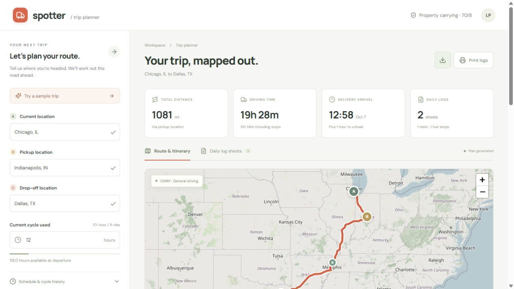
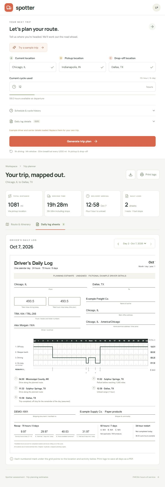
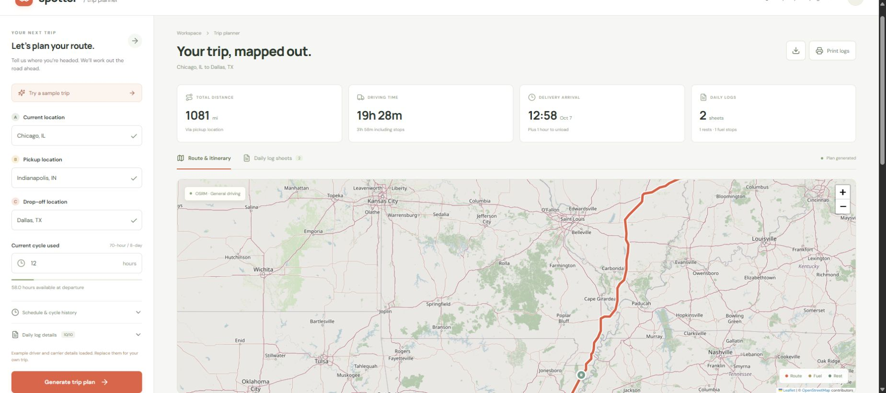

# Verification — 2026-10-06

- Django: 14 tests passed, including driving/break/window/fuel/cycle constraints, rolling midnight, restart history, full-day sheet coverage, API errors, both provider adapters, and DST rejection.
- React/TypeScript: `npm run build` passed. Prettier and Ruff checks passed.
- npm installation audit: zero reported vulnerabilities at installation time.
- Built application served with Waitress, WhiteNoise, and `DEBUG=false`; root page, health endpoint, and JavaScript asset returned HTTP 200.
- Browser: sample generation, manual city search/selection, map rendering, both sheets, next-day navigation, inconsistent cycle-history validation, and a 70-hour cycle requiring a 34-hour restart were verified.
- Browser responsive check at 390 px: layout stacks vertically, and document width stays within viewport. Paper sheets retain their readable width inside a horizontally scrollable container.
- Browser production console: no captured errors or warnings during the sample flow.
- JSON download found in Downloads and parsed successfully: two daily logs, 2,786 displayed geometry points, and 86,400 seconds on each daily sheet.

## Live sample

Chicago → Indianapolis → Dallas, departure October 6 at 06:00 America/Chicago, initial cycle 12 hours:

- OSRM road route: 1,080.5 miles.
- Driving: 19h 28m 28s.
- Total trip including pickup, unload, rest and fuel: 31h 58m 28s.
- One 10-hour rest and one fuel stop before 1,000 miles.
- Delivery arrival October 7 at 12:58 terminal time, followed by one hour unloading.
- Two daily sheets, with 587.0 and 493.5 miles respectively (rounded).
- Intermediate labels successfully resolved near Mississippi County, AR, and Sulphur Springs, TX.

## Remaining external checks/delivery

- No ORS key was supplied. Its adapter was tested with a provider-shaped response, not a live authenticated HGV route.
- Print stylesheet is implemented; native browser PDF print preview/output was not verified through the available browser controls. Check Letter portrait output before submission.
  Direct PDF download is now implemented separately and verified: a two-day example downloaded a two-page Letter PDF (~360 KB), and both pages were rendered and visually reviewed.
- Docker CLI exists, but Docker Desktop's Linux daemon was not running; the image was not built locally. Runtime/static-file serving was tested directly with the production server instead.
- No Git remote or authenticated hosting destination was configured. There are no created GitHub, hosted, or Loom URLs yet.
- Provider routes and stop positions remain estimates, as documented in README and shown in the interface.

## Map tile access and zoom correction

An OSM 403 tile message exposed a configuration error: Django's `same-origin` referrer policy suppressed identification on cross-origin map requests. The page now uses `strict-origin-when-cross-origin`, and Leaflet tile images explicitly use the same policy. No proxy, cache bypass, or hidden error images were introduced.

The rebuilt application was checked in the browser: map images rendered normally, their DOM referrer policy matched the intended setting, zoom buttons worked, and a wheel interaction increased the displayed tile zoom to level 7. The 14 backend tests, formatting checks, and production build passed again.

